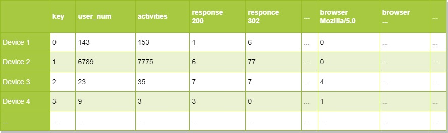

# The final work for Data Architecture crush course 2022.

## Structure

The repository contains one folder - *src*, in which *data* folder contains
the source of data (dataset) and *log_parser* folder contains **.ipynb** file with solution.

## Solution

The solution pipeline is following:

1. to open and read dataset;
2. to parse data into dict ('json' looking) type with fields listed in task:
3. make visualisation.

## Table

The final table looks like follows:

and obtains the following fields:

- key;
- device name;
- user number;
- device activity;
- browser statistics;
- response 200 statistics;
- other responses' types statistics;

the type for all fields is **string**.

## Stack

The stack for current work is based on Python 3.10 libraries such as numpy
for statistics calculations, pandas for dataframe operating and 
matplotlib for visualization. I used *jupyter notebook* format in order to
simplify the visualization of the data.

